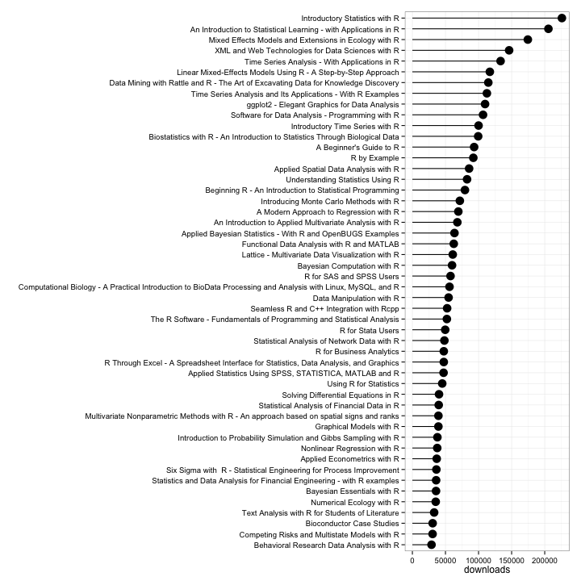

```r
options(width = 400)

#
#
#  Explore the R related books scraped from Springer site
#  Specific questions considered:
#  - Find the most downloaded books
#  - Contruct a network of the R related books based on recommended books with each book and explore the network
#        +  Find any disconnected components of the graph
#        +  Find books that have largest degree (most recommended)
# 
#  Note: Some tables are wide and only part of them are showing. You can scroll 
#  to the right to see the remaining part of the table

# load libraries
library(dplyr)
library(tidyr)
library(ggplot2)
library(igraph)
library(networkD3)

# load data
load(file = "bookinfodf.Rda") # info on books
load(file = "recobookinfodf.Rda") # info on recommended books

head(data.frame(bookinfodf))
```

```
##                                                                                                                                    title                                                                      authors                series pubyr price1 price1curr price2 price2curr citations downloads                                          link id
## 1            Innovation without R&D - Heterogeneous Innovation Patterns of Non-R&D-Performing Firms in the German Manufacturing Industry                                                                   Oliver Som                  none  2012  89.00        USD 119.00        USD         1      3357 http://www.springer.com/us/book/9783834934918  1
## 2 Geochemical Modelling of Igneous Processes – Principles And Recipes in R Language - Bringing the Power of R to a Geochemical Community Vojtěch Janoušek;Jean-François Moyen;Hervé Martin;Vojtěch Erban;Colin Farrow Springer Geochemistry  2015  69.99        USD  99.00        USD         0      2279 http://www.springer.com/us/book/9783662467916  2
## 3                                                                               Beginning R - An Introduction to Statistical Programming                                                                   Larry Pace                  none  2012  29.99        USD  39.99        USD         0     79426 http://www.springer.com/us/book/9781430245544  3
## 4                                                                                                                                 Pro R                                                                    Larry Pace                  none  2016  29.99        USD  49.99        USD         0         0 http://www.springer.com/us/book/9781484200926  4
## 5                                                                               Beginning R - An Introduction to Statistical Programming                                                      Larry Pace;Joshua Wiley                  none  2015  29.99        USD  39.99        USD         0      3441 http://www.springer.com/us/book/9781484203743  5
## 6                                                                                                R Recipes - A Problem-Solution Approach                                                                   Larry Pace                  none  2014  29.99        USD  39.99        USD         1     12156 http://www.springer.com/us/book/9781484201312  6
```

```r
head(data.frame(recobookinfodf))
```

```
##                                                                                                                         title                                                               recobooks                                 recobooklinks rnk id
## 1 Innovation without R&D - Heterogeneous Innovation Patterns of Non-R&D-Performing Firms in the German Manufacturing Industry                                                     Electronic Commerce http://www.springer.com/us/book/9783319100906   1  1
## 2 Innovation without R&D - Heterogeneous Innovation Patterns of Non-R&D-Performing Firms in the German Manufacturing Industry                                        Customer Relationship Management http://www.springer.com/us/book/9783642201097   2  1
## 3 Innovation without R&D - Heterogeneous Innovation Patterns of Non-R&D-Performing Firms in the German Manufacturing Industry                                      Multiple Attribute Decision Making http://www.springer.com/us/book/9783540105589   3  1
## 4 Innovation without R&D - Heterogeneous Innovation Patterns of Non-R&D-Performing Firms in the German Manufacturing Industry                            Sustainability and Human Resource Management http://www.springer.com/us/book/9783642375231   4  1
## 5 Innovation without R&D - Heterogeneous Innovation Patterns of Non-R&D-Performing Firms in the German Manufacturing Industry Let's Get Engaged! Crossing the Threshold of Marketing’s Engagement Era http://www.springer.com/us/book/9783319118147   5  1
## 6 Innovation without R&D - Heterogeneous Innovation Patterns of Non-R&D-Performing Firms in the German Manufacturing Industry                                        Linear and Nonlinear Programming http://www.springer.com/us/book/9783319188416   6  1
```

```r
paste0("Number of books = ",nrow(bookinfodf))
```

```
## [1] "Number of books = 154"
```

```r
# Remove titles not related to R
# Criteria (1) R appears in the beginning or end of title or in the middle with spaces around it
# Criteria (2) Series is related to statistics
RinTitle = grepl("^R .*$|^.* R$| R ",bookinfodf$title)

# Series in the book list
seriesList = unique(bookinfodf$series)
statsSeries = seriesList[grep("Statistics",seriesList)]
statsSeries
```

```
##  [1] "Statistics and Computing"                  "Springer Texts in Statistics"              "SpringerBriefs in Statistics"              "Springer Series in Statistics"             "Statistics for Biology and Health"         "Statistics for Industry and Technology"    "Lecture Notes in Statistics"               "Lecture Notes in Statistics - Proceedings" "ICSA Book Series in Statistics"           
## [10] "Environmental and Ecological Statistics"
```

```r
seriesOfInterest = c("Use R!",statsSeries) # statsSeries doesn't have Use R, so added manually

# keep only R or stats relevant books
incbook = RinTitle | (bookinfodf$series %in% seriesOfInterest)
bookinfodf_filt = bookinfodf[incbook,]
recobookinfodf_filt = inner_join(recobookinfodf,bookinfodf_filt[,"id"],by = "id")

paste0("Number of books after filtering non R books = ",nrow(bookinfodf_filt))
```

```
## [1] "Number of books after filtering non R books = 120"
```

```r
# check dropped books
data.frame(bookinfodf[!incbook,"title"])
```

```
##                                                                                                                                                                                title
## 1                                                        Innovation without R&D - Heterogeneous Innovation Patterns of Non-R&D-Performing Firms in the German Manufacturing Industry
## 2                                                                                                                                                                     R&D Management
## 3                                                                                                                                            F. R. Leavis  - The Creative University
## 4                                                                      Open Innovation in R&D Departments - An Analysis of Employees’ Intention to Exchange Knowledge in OI-Projects
## 5                                                                                      R-Matrix Theory of Atomic Collisions - Application to Atomic, Molecular and Optical Processes
## 6                                                                                                                  A Glimpse at Hilbert Space Operators - Paul R. Halmos in Memoriam
## 7                                                                                                        Innovation and IT in an International Context - R&D strategy and operations
## 8                                                                                                           The Public Sector R&D Enterprise - A New Approach to Portfolio Valuation
## 9                                                                                                                   (R)Evolution - Organizations and the Dynamics of the Environment
## 10                                                                                                                                  The Geography of Networks and R&D Collaborations
## 11                                                                                                                                   Vacuum-Assisted Breast Biopsy with Mammotome(R)
## 12                                                                                                                                                 Space groups (156) P3m1-(148) R-3
## 13                                                                                               Symmetry: Representation Theory and Its Applications - In Honor of Nolan R. Wallach
## 14                                                                                       Optimization of Pharmaceutical R&D Programs and Portfolios - Design and Investment Strategy
## 15                                                                                                                       Cloud Computing - Challenges, Limitations and R&D Solutions
## 16                                                                                                                             Space groups (148) R-3-(141)I41/amd - Structure Types
## 17                                                        Eurocode-Compliant Seismic Analysis and Design of R/C Buildings - Concepts, Commentary and Worked Examples with Flowcharts
## 18                                                                                The Keys of Middle-earth - Discovering Medieval Literature Through the Fiction of J. R. R. Tolkien
## 19                                                                                                The New Health Bioeconomy - R&D Policy and Innovation for the Twenty-First Century
## 20                                                                                                  Advanced Spark for Professionals - Analytics for Data Driven Enterprises and R&D
## 21                                        Proceedings of the 8th International Symposium on Heating, Ventilation and Air Conditioning - Volume 2: HVAC&R Component and Energy System
## 22                                                                                             Bending the Arc of Innovation - Public Support of R&D in Small, Entrepreneurial Firms
## 23                                                                                      Acoustics, Information, and Communication - Memorial Volume in Honor of Manfred R. Schroeder
## 24                                                                                    Analysis of the Electric Dipole Moment in the R-parity Violating Supersymmetric Standard Model
## 25                                                                                                   Improving the Efficiency of R&D and the Market Diffusion of Energy Technologies
## 26 Creating R&D Incentives for Medicines for Neglected Diseases - An Economic Analysis of Parallel Imports, Patents, and Alternative Mechanisms to Stimulate Pharmaceutical Research
## 27                                                         Institutional Economics and the Theory of Social Value: Essays in Honor of Marc R. Tool - Essays in Honor of Marc R. Tool
## 28                                                                                                                                               Space groups (166) R-3m – (160) R3m
## 29                                                                Multiple Stars across the H-R Diagram - Proceedings of the ESO Workshop held in Garching, Germany, 12-15 July 2005
## 30                                                                                                                                               Space groups (173) P63 – (166) R-3m
## 31                                                                                                                                                  R-Trees: Theory and Applications
## 32                                                                                                            Digital (R)Evolution in Radiology - Bridging the Future of Health Care
## 33                                                                                 The Liquid Crystal Display Story - 50 Years of Liquid Crystal R&D that lead The Way to the Future
## 34                                                                                Persistence Pays - U.S. Agricultural Productivity Growth and the Benefits from Public R&D Spending
```

```r
# sort books based on number of downloads and show top 50 downloaded books
downloads_srt = bookinfodf_filt %>% arrange(desc(downloads)) %>% select(title,downloads)
#data.frame(downloads_srt[1:50,])
```

```r
p = ggplot(data = downloads_srt[1:50,]) + geom_point(aes(x = reorder(title,downloads),y = downloads),size = 5) + 
  geom_segment(aes(x = reorder(title,downloads), y = 0, xend = reorder(title,downloads),yend = downloads)) + 
  xlab("") + 
  theme_bw() + coord_flip()
p
```

 

```r
# Number of books published by year
#table(bookinfodf_filt$pubyr)

booksbyyr = bookinfodf_filt %>% group_by(pubyr) %>% summarize(numbooks = n())
```

```r
p = ggplot(data = booksbyyr) + geom_bar(aes(x = factor(pubyr),y = numbooks),stat = "identity",fill = "grey") + 
   xlab("") + ylab("# books") + theme_bw()
p
```

 

```r
# Upcoming books to be published in 2016 and beyond
data.frame(bookinfodf[bookinfodf$pubyr >= 2016,]) # looks like still non-R books are there in the list
```

```
##                                                                                                                        title                                                                                              authors                                              series pubyr price1 price1curr price2 price2curr citations downloads                                          link  id
## 1                                                                                                                     Pro R                                                                                            Larry Pace                                                none  2016  29.99        USD  49.99        USD         0         0 http://www.springer.com/us/book/9781484200926   4
## 2                                                                                    F. R. Leavis  - The Creative University                                                                                     Steven Cranfield         SpringerBriefs on Key Thinkers in Education  2016  39.99        USD  54.99        USD         0       124 http://www.springer.com/us/book/9783319259833  34
## 3                                                                    Principal Component and Correspondence Analyses Using R                                                                              Hervé Abdi;Derek Beaton                        SpringerBriefs in Statistics  2017  39.99        USD  54.99        USD         0         0 http://www.springer.com/us/book/9783319092553  85
## 4 Eurocode-Compliant Seismic Analysis and Design of R/C Buildings - Concepts, Commentary and Worked Examples with Flowcharts Ioannis Avramidis;Asimina Athanatopoulou;Konstantinos Morfidis;Anastasios Sextos;Agathoklis Giaralis Geotechnical, Geological and Earthquake Engineering  2016 139.00        USD 179.00        USD         0       125 http://www.springer.com/us/book/9783319252698 119
## 5                                                                            Learning Analytics in R with SNA, LSA, and MPIA                                                                                        Fridolin Wild                                                none  2016  99.00        USD 129.00        USD         0         0 http://www.springer.com/us/book/9783319287898 124
## 6                                         The New Health Bioeconomy - R&D Policy and Innovation for the Twenty-First Century                                                                                         James Mittra                                                none  2016  79.99        USD 105.00        USD         0         0 http://www.springer.com/us/book/9781137436283 126
## 7                                              Data Wrangling - Munging in R with SQL and MongoDB for Financial Applications                                                                    Patrick Houlihan;Alexander Moreno                                                none  2016  29.99        USD  49.99        USD         0         0 http://www.springer.com/us/book/9781484206126 129
## 8                                           Advanced Spark for Professionals - Analytics for Data Driven Enterprises and R&D                                                                                       Henning Dekant                                                none  2016  29.99        USD  49.99        USD         0         0 http://www.springer.com/us/book/9781484214626 130
## 9                                                                               ggplot2 - Elegant Graphics for Data Analysis                                                                        Hadley Wickham;Carson Sievert                                              Use R!  2016  44.99        USD  59.99        USD         0         0 http://www.springer.com/us/book/9783319242750 151
```

```r
##  exploring book recommendations

# books appearing multiple times due to different editions
dupbooks = unique(bookinfodf_filt$title[duplicated(bookinfodf_filt[,c("title")])])
data.frame(bookinfodf_filt[bookinfodf_filt$title %in% dupbooks,])
```

```
##                                                      title                       authors series pubyr price1 price1curr price2 price2curr citations downloads                                          link  id
## 1 Beginning R - An Introduction to Statistical Programming                    Larry Pace   none  2012  29.99        USD  39.99        USD         0     79426 http://www.springer.com/us/book/9781430245544   3
## 2 Beginning R - An Introduction to Statistical Programming       Larry Pace;Joshua Wiley   none  2015  29.99        USD  39.99        USD         0      3441 http://www.springer.com/us/book/9781484203743   5
## 3             ggplot2 - Elegant Graphics for Data Analysis Hadley Wickham;Carson Sievert Use R!  2016  44.99        USD  59.99        USD         0         0 http://www.springer.com/us/book/9783319242750 151
## 4             ggplot2 - Elegant Graphics for Data Analysis                Hadley Wickham Use R!  2009  49.99        USD  69.95        USD       456    109832 http://www.springer.com/us/book/9780387981406 153
```

```r
# remove the books with latest edition for simplicity
bookinfodf_filt2 = bookinfodf_filt[!(bookinfodf_filt$id %in% c(5,151)),]


# create a wt that is 9 - rank so that higher lower rank corresponds to higher wt
recobookinfodf_filt$wt = 9 - recobookinfodf_filt$rnk
#unique(recobookinfodf_filt[,c("wt","rnk")])

recobookinfodf_filt2 = recobookinfodf_filt[!duplicated(recobookinfodf_filt[,c("title","recobooks")]),]

# keep only recommended books that are part of the original R book list 
# here it is done by merging recobooks with original book list based on recobooks field
recobookinfodf_filt2 = inner_join(recobookinfodf_filt,bookinfodf_filt2[,c("id")],by = c("id"))
names(recobookinfodf_filt2)[names(recobookinfodf_filt2) == "id"] = "titleid"
names(recobookinfodf_filt2)[names(recobookinfodf_filt2) == "title"] = "titlefrom"
recobookinfodf_filt2 = inner_join(recobookinfodf_filt2,bookinfodf_filt2[,c("id","link","title")],by = c("recobooklinks" = "link"))
names(recobookinfodf_filt2)[names(recobookinfodf_filt2) == "id"] = "recoid"
names(recobookinfodf_filt2)[names(recobookinfodf_filt2) == "title"] = "titleto"


# Create an undirected graph based on books <-> recobooks links
edgelist = recobookinfodf_filt2[,c("titlefrom","titleto","wt")]
names(edgelist) = c("from","to","weights")
head(edgelist,10)
```

```
## Source: local data frame [10 x 3]
## 
##                                                                            from                                            to weights
##                                                                           (chr)                                         (chr)   (dbl)
## 1                      Beginning R - An Introduction to Statistical Programming               Introductory Time Series with R       5
## 2                      Beginning R - An Introduction to Statistical Programming                    Modern Optimization with R       4
## 3                      Beginning R - An Introduction to Statistical Programming Time Series Analysis - With Applications in R       1
## 4                                                                  R by Example        R for Marketing Research and Analytics       8
## 5                                                                  R by Example  ggplot2 - Elegant Graphics for Data Analysis       6
## 6                                                                  R by Example                    Political Analysis Using R       5
## 7                                                                  R by Example                       A Beginner's Guide to R       3
## 8  Biostatistics with R - An Introduction to Statistics Through Biological Data        R for Marketing Research and Analytics       8
## 9  Biostatistics with R - An Introduction to Statistics Through Biological Data  ggplot2 - Elegant Graphics for Data Analysis       6
## 10 Biostatistics with R - An Introduction to Statistics Through Biological Data                    Political Analysis Using R       5
```

```r
g = graph_from_data_frame(edgelist,vertices = bookinfodf_filt2$title,directed = FALSE)

# Find disconnected components
comps = clusters(g)
paste0("Number of disconnected components = ",length(comps$csize))
```

```
## [1] "Number of disconnected components = 24"
```

```r
paste0("Number of titles in each component")
```

```
## [1] "Number of titles in each component"
```

```r
comps$csize
```

```
##  [1]  1 17  1  1 65  9  1  1  3  4  1  1  1  2  1  1  1  1  1  1  1  1  1  1
```

```r
# Find the titles that appear as one off components
names(comps$membership)[comps$csize[comps$membership] == 1]
```

```
##  [1] "Geochemical Modelling of Igneous Processes – Principles And Recipes in R Language - Bringing the Power of R to a Geochemical Community" "Pro R "                                                                                                                                
##  [3] "R Recipes - A Problem-Solution Approach"                                                                                                "R Quick Syntax Reference"                                                                                                              
##  [5] "Using R for Statistics"                                                                                                                 "Beginning Data Science with R"                                                                                                         
##  [7] "Qualitative Comparative Analysis with R - A User’s Guide"                                                                               "Introduction to Image Processing Using R - Learning by Examples"                                                                       
##  [9] "Assessing Schools for Generation R (Responsibility) - A Guide for Legislation and School Policy in Science Education"                   "Computational Finance - An Introductory Course with R"                                                                                 
## [11] "Benchmarking with DEA, SFA, and R"                                                                                                      "Pro Data Visualization using R and JavaScript"                                                                                         
## [13] "Guide to Programming and Algorithms Using R"                                                                                            "Computer Simulation and Data Analysis in Molecular Biology and Biophysics - An Introduction Using R"                                   
## [15] "Learning Analytics in R with SNA, LSA, and MPIA"                                                                                        "Data Wrangling - Munging in R with SQL and MongoDB for Financial Applications"                                                         
## [17] "Spatial Database for GPS Wildlife Tracking Data - A Practical Guide to Creating a Data Management System with PostgreSQL/PostGIS and R" "Computational Biology - A Practical Introduction to BioData Processing and Analysis with Linux, MySQL, and R"
```

```r
# Other connected components with few vertices
names(comps$membership)[comps$csize[comps$membership] == 3] # finance
```

```
## [1] "Quantitative Trading with R - Understanding Mathematical and Computational Tools from a Quant’s Perspective" "Modern Actuarial Risk Theory - Using R"                                                                      "Analyzing Financial Data and Implementing Financial Models Using R"
```

```r
names(comps$membership)[comps$csize[comps$membership] == 4] # econometrics
```

```
## [1] "A Primer for Spatial Econometrics - With Applications in R"                           "An Introduction to R for Quantitative Economics - Graphing, Simulating and Computing" "Applied Econometrics with R"                                                          "Analysis of Integrated and Cointegrated Time Series with R"
```

```r
names(comps$membership)[comps$csize[comps$membership] == 9] # ecology, chemometrics etc.
```

```
## [1] "Chemometrics with R - Multivariate Data Analysis in the Natural Sciences and Life Sciences" "Analysis of Phylogenetics and Evolution with R"                                             "Morphometrics with R"                                                                       "Applied Statistical Genetics with R - For Population-based Association Studies"            
## [5] "A Practical Guide to Ecological Modelling - Using R as a Simulation Platform"               "A Primer of Ecology with R"                                                                 "A Guide to QTL Mapping with R/qtl"                                                          "Mixed Effects Models and Extensions in Ecology with R"                                     
## [9] "Bioconductor Case Studies"
```

```r
names(comps$membership)[comps$csize[comps$membership] == 17]
```

```
##  [1] "Beginning R - An Introduction to Statistical Programming"                                 "Quality Control with R - An ISO Standards Approach"                                       "Modern Optimization with R"                                                               "Introducing Monte Carlo Methods with R"                                                  
##  [5] "A User’s Guide to Network Analysis in R"                                                  "R Through Excel - A Spreadsheet Interface for Statistics, Data Analysis, and Graphics"    "Bayesian Computation with R"                                                              "Multivariate Nonparametric Methods with R - An approach based on spatial signs and ranks"
##  [9] "Introductory Time Series with R"                                                          "Data Manipulation with R"                                                                 "Nonlinear Regression with R"                                                              "Introductory Statistics with R"                                                          
## [13] "Time Series Analysis - With Applications in R"                                            "Software for Data Analysis - Programming with R"                                          "Lattice - Multivariate Data Visualization with R"                                         "Wavelet Methods in Statistics with R"                                                    
## [17] "A Modern Approach to Regression with R"
```

```r
# find degree distribition
table(degree(g))
```

```
## 
##  0  1  2  3  4  5  6  7  8 10 11 13 14 15 17 19 50 51 56 
## 18  9  4  5 47  4  3  4  5  4  1  2  4  2  1  1  2  1  1
```

```r
# find titles with highest degree
# doesn't seem to correlate well with downloads
degree_df = data.frame(title = names(degree(g)),degree = degree(g))
degree_df = inner_join(degree_df,bookinfodf_filt2[,c("title","downloads")],by = "title")
```

```
## Warning in inner_join_impl(x, y, by$x, by$y): joining factor and character vector, coercing into character vector
```

```r
degree_df %>% arrange(desc(degree)) %>% head(20)
```

```
##                                                                           title degree downloads
## 1                                                       A Beginner's Guide to R     56     93308
## 2                                  ggplot2 - Elegant Graphics for Data Analysis     51    109832
## 3                                                    Political Analysis Using R     50      4232
## 4                                        R for Marketing Research and Analytics     50     16868
## 5                                               Introductory Time Series with R     19    100013
## 6                                                      Data Manipulation with R     17     54722
## 7                                                   Bayesian Computation with R     15     59948
## 8                                                   Nonlinear Regression with R     15     37563
## 9                                                          Meta-Analysis with R     14      5503
## 10                                                 Dynamic Linear Models with R     14     17242
## 11                                Time Series Analysis - With Applications in R     14    133288
## 12                                   Functional Data Analysis with R and MATLAB     14     62537
## 13                                                   Modern Optimization with R     13     16126
## 14                                          Analyzing Compositional Data with R     13     25018
## 15 Humanities Data in R - Exploring Networks, Geospatial Data, Images, and Text     11      4850
## 16                                          Solving Differential Equations in R     10     40248
## 17                                 Multistate Analysis of Life Histories with R     10     13141
## 18                              Software for Data Analysis - Programming with R     10    106786
## 19                                         Wavelet Methods in Statistics with R     10     19496
## 20             Introduction to Probability Simulation and Gibbs Sampling with R      8     37809
```

```r
#
# for example: R for Marketing Research and Analytics has degree 50 i.e being recommended
# along with several other books. Not sure how Springer reco system works
#
recobookinfodf_filt2[grepl("Marketing Research",recobookinfodf_filt2$titleto),c("titlefrom","titleto")]
```

```
## Source: local data frame [44 x 2]
## 
##                                                                       titlefrom                                titleto
##                                                                           (chr)                                  (chr)
## 1                                                                  R by Example R for Marketing Research and Analytics
## 2  Biostatistics with R - An Introduction to Statistics Through Biological Data R for Marketing Research and Analytics
## 3                                                      Numerical Ecology with R R for Marketing Research and Analytics
## 4                                                          Meta-Analysis with R R for Marketing Research and Analytics
## 5                                                       Graphical Models with R R for Marketing Research and Analytics
## 6                 Bayesian Networks in R - with Applications in Systems Biology R for Marketing Research and Analytics
## 7           Six Sigma with  R - Statistical Engineering for Process Improvement R for Marketing Research and Analytics
## 8                                                    Political Analysis Using R R for Marketing Research and Analytics
## 9                                     Forest Analytics with R - An Introduction R for Marketing Research and Analytics
## 10        The R Software - Fundamentals of Programming and Statistical Analysis R for Marketing Research and Analytics
## ..                                                                          ...                                    ...
```

```r
# plot the network with networkD3
# code adapted from https://christophergandrud.github.io/networkD3/
pltNodes = data.frame(name = bookinfodf_filt2$title, group = 1,size = 1)
pltNodes$name = as.character(pltNodes$name)
pltNodes$group = comps$membership[pltNodes$name] # group is the connected component number
pltNodes$id = seq(0,nrow(pltNodes) - 1) # networkD3 mentioned something about starting index with 0

pltLinks = recobookinfodf_filt2[,c("titlefrom","titleto","wt")]
pltLinks = inner_join(pltLinks,pltNodes[,c("id","name")],by = c("titlefrom" = "name"))
names(pltLinks)[names(pltLinks) == "id"] = "source"

pltLinks = inner_join(pltLinks,pltNodes[,c("id","name")],by = c("titleto" = "name"))
names(pltLinks)[names(pltLinks) == "id"] = "target"


forceNetwork(Links = pltLinks, Nodes = pltNodes,
             Source = "source", Target = "target",
             Value = "wt", NodeID = "name",
             Group = "group", opacity = 0.8,zoom = TRUE,fontSize = 20)
```

<!--html_preserve--><div id="htmlwidget-3736" style="width:576px;height:360px;" class="forceNetwork"></div>
<script type="application/json" data-for="htmlwidget-3736">{"x":{"links":{"source":[1,1,1,4,4,4,4,5,5,5,5,6,6,6,6,7,7,7,7,7,8,8,8,8,8,9,9,9,10,10,10,10,11,11,11,11,12,12,13,13,13,13,14,14,14,14,14,14,15,15,15,15,16,16,16,16,17,17,17,17,17,18,18,18,18,19,19,19,19,20,20,20,20,21,21,21,21,22,22,22,22,22,22,23,23,23,23,25,25,25,25,26,26,26,26,28,28,28,28,28,29,30,30,30,30,30,30,31,31,31,31,32,32,32,32,33,33,33,33,34,34,34,34,35,35,35,36,36,36,36,37,37,37,37,38,38,38,38,39,40,41,42,42,42,42,43,43,43,43,44,44,44,44,45,45,45,46,46,46,47,47,47,47,47,49,49,49,49,50,50,50,50,50,50,50,51,51,51,51,51,53,53,53,53,54,54,54,54,56,56,56,56,57,57,57,57,59,59,59,59,60,60,60,60,61,62,62,62,62,63,65,65,65,65,67,67,67,69,69,69,69,69,70,70,70,70,71,71,71,72,72,72,72,72,72,73,73,73,73,73,73,73,74,74,74,74,75,75,75,75,75,75,75,75,76,76,77,77,77,77,77,77,77,77,78,79,79,79,79,80,80,80,80,81,82,82,82,82,83,83,84,84,84,84,85,85,85,85,88,88,88,88,89,89,89,89,89,90,91,91,92,92,92,92,92,93,93,93,93,93,94,94,94,94,95,95,95,96,96,96,96,96,100,100,100,101,101,101,101,102,102,102,102,102,102,103,103,103,103,103,105,105,105,105,107,107,107,107,107,109,110,110,110,110,115,115,115,115,116,116,116,117,117,117,117,117],"target":[73,12,89,30,116,14,69,30,116,14,69,30,116,14,69,117,71,61,95,111,30,51,14,17,69,43,12,102,30,116,14,69,30,116,14,69,73,50,30,116,14,69,17,30,51,8,28,69,30,116,14,69,30,116,14,69,83,14,8,51,30,30,116,14,69,30,116,14,69,30,116,14,69,30,116,14,69,92,46,94,70,8,96,30,116,14,69,30,116,14,69,30,116,14,69,110,72,51,69,83,99,8,51,14,17,69,116,30,116,14,69,30,116,14,69,30,116,14,69,30,116,14,69,73,12,89,30,116,14,69,30,116,14,69,30,116,14,69,111,99,109,30,116,14,69,9,12,77,73,30,116,14,69,73,12,89,22,70,96,92,100,8,58,69,30,116,14,69,75,73,77,88,93,12,101,30,8,14,17,28,30,116,14,69,30,116,14,69,30,116,14,69,30,116,14,69,30,116,14,69,30,116,14,69,95,30,116,14,69,98,30,116,14,69,73,12,89,116,72,28,96,8,72,96,22,28,95,7,106,28,69,70,110,116,96,89,75,77,50,12,93,103,58,17,116,8,50,93,73,77,88,103,101,12,78,109,103,73,75,50,102,101,12,43,109,30,116,14,69,30,116,14,69,116,30,116,14,69,17,28,30,116,14,69,30,116,14,69,75,50,89,93,73,93,88,75,102,111,116,58,22,47,8,96,110,75,89,73,50,88,22,110,69,96,71,61,111,116,69,72,70,28,47,58,72,102,75,77,50,101,77,89,9,75,50,77,75,73,12,89,30,116,14,69,112,69,72,116,96,78,28,72,58,69,30,116,14,69,69,72,96,7,61,106,71,95],"value":[5,4,1,8,6,5,3,8,6,5,3,8,6,5,3,8,7,6,5,2,8,7,6,5,3,8,5,1,8,6,5,3,8,6,5,3,8,2,8,6,5,3,8,7,6,5,2,1,8,6,5,3,8,6,5,3,8,7,5,4,3,8,6,5,3,8,6,5,3,8,6,5,3,8,6,5,3,8,6,5,4,3,2,8,6,5,3,8,6,5,3,8,6,5,3,8,6,5,3,2,8,8,7,6,4,2,1,8,6,5,3,8,6,5,3,8,6,5,3,8,6,5,3,5,4,1,8,6,5,3,8,6,5,3,8,6,5,3,6,6,5,8,6,5,3,8,4,3,1,8,6,5,3,5,4,1,7,2,1,6,5,4,3,1,8,6,5,3,8,7,6,5,4,3,2,8,7,6,5,4,8,6,5,3,8,6,5,3,8,6,5,3,8,6,5,3,8,6,5,3,8,6,5,3,7,8,6,5,3,8,8,6,5,3,5,4,1,8,6,5,4,2,8,6,4,3,7,4,1,8,7,6,4,3,2,8,7,6,5,4,3,1,7,5,4,2,8,7,6,5,4,3,2,1,7,6,8,7,6,5,4,3,2,1,8,8,6,5,3,8,6,5,3,3,8,6,5,3,8,5,8,6,5,3,8,6,5,3,8,5,3,2,8,6,5,3,1,6,6,3,8,6,5,3,1,8,6,5,3,2,7,5,3,1,5,3,1,7,5,4,3,2,7,3,1,8,7,5,4,8,7,5,3,2,1,8,7,5,4,1,8,6,5,3,7,6,5,4,3,8,8,5,3,1,8,6,5,3,8,6,5,8,5,3,2,1]},"nodes":{"name":["Geochemical Modelling of Igneous Processes – Principles And Recipes in R Language - Bringing the Power of R to a Geochemical Community","Beginning R - An Introduction to Statistical Programming","Pro R ","R Recipes - A Problem-Solution Approach","R by Example","Biostatistics with R - An Introduction to Statistics Through Biological Data","Numerical Ecology with R","Chemometrics with R - Multivariate Data Analysis in the Natural Sciences and Life Sciences","Meta-Analysis with R","Quality Control with R - An ISO Standards Approach","Graphical Models with R","Bayesian Networks in R - with Applications in Systems Biology","Modern Optimization with R","Six Sigma with  R - Statistical Engineering for Process Improvement","Political Analysis Using R","Forest Analytics with R - An Introduction","The R Software - Fundamentals of Programming and Statistical Analysis","Humanities Data in R - Exploring Networks, Geospatial Data, Images, and Text","Understanding Statistics Using R","Bayesian Essentials with R","R for Business Analytics","R for Cloud Computing - An Approach for Data Scientists","Solving Differential Equations in R","Behavioral Research Data Analysis with R","R Quick Syntax Reference","R for Stata Users","Modeling Psychophysical Data in R","Using R for Statistics","Analyzing Compositional Data with R","Quantitative Trading with R - Understanding Mathematical and Computational Tools from a Quant’s Perspective","R for Marketing Research and Analytics","Applied Spatial Data Analysis with R","Data Mining with Rattle and R - The Art of Excavating Data for Knowledge Discovery","An Introduction to Statistical Learning - with Applications in R","Time Series Analysis and Its Applications - With R Examples","Introducing Monte Carlo Methods with R","Statistics and Data Analysis for Financial Engineering - with R examples","Multiple Decrement Models in Insurance - An Introduction Using R","Seamless R and C++ Integration with Rcpp","Analysis of Phylogenetics and Evolution with R","Modern Actuarial Risk Theory - Using R","A Primer for Spatial Econometrics - With Applications in R","Statistical Analysis of Network Data with R","A User’s Guide to Network Analysis in R","An Introduction to Applied Multivariate Analysis with R","R Through Excel - A Spreadsheet Interface for Statistics, Data Analysis, and Graphics","A Tiny Handbook of R","Primer to Analysis of Genomic Data Using R","Beginning Data Science with R","Competing Risks and Multistate Models with R","Bayesian Computation with R","Multistate Analysis of Life Histories with R","Qualitative Comparative Analysis with R - A User’s Guide","R for SAS and SPSS Users","Applied Bayesian Statistics - With R and OpenBUGS Examples","Introduction to Image Processing Using R - Learning by Examples","Functional and Phylogenetic Ecology in R","Vector Generalized Linear and Additive Models - With an Implementation in R","Applied Multivariate Statistics with R","Multivariate Statistical Quality Control Using R","Contingency Table Analysis - Methods and Implementation Using R","Morphometrics with R","Linear Mixed-Effects Models Using R - A Step-by-Step Approach","Production and Efficiency Analysis with R","Assessing Schools for Generation R (Responsibility) - A Guide for Legislation and School Policy in Science Education","XML and Web Technologies for Data Sciences with R","Computational Finance - An Introductory Course with R","Multivariate Nonparametric Methods with R - An approach based on spatial signs and ranks","Benchmarking with DEA, SFA, and R","A Beginner's Guide to R","Introduction to Probability Simulation and Gibbs Sampling with R","Applied Statistical Genetics with R - For Population-based Association Studies","Dynamic Linear Models with R","Introductory Time Series with R","Principal Component and Correspondence Analyses Using R","Data Manipulation with R","An Introduction to R for Quantitative Economics - Graphing, Simulating and Computing","Nonlinear Regression with R","Applied Econometrics with R","EnvStats - An R Package for Environmental Statistics","Statistical Analysis of Financial Data in R","Statistical Analysis of Climate Series - Analyzing, Plotting, Modeling, and Predicting with R","Two-Way Analysis of Variance - Statistical Tests and Graphics Using R","Text Analysis with R for Students of Literature","Statistical Analysis and Data Display - An Intermediate Course with Examples in R","Advances in Social Science Research Using R","Pro Data Visualization using R and JavaScript","Guide to Programming and Algorithms Using R","Introductory Statistics with R","Time Series Analysis - With Applications in R","A Practical Guide to Ecological Modelling - Using R as a Simulation Platform","Permutation Tests for Stochastic Ordering and ANOVA - Theory and Applications with R","Modeling Dose-Response Microarray Data in Early Drug Development Experiments Using R - Order-Restricted Analysis of Microarray Data","Software for Data Analysis - Programming with R","Simulation and Inference for Stochastic Differential Equations - With R Examples","A Primer of Ecology with R","Functional Data Analysis with R and MATLAB","Computer Simulation and Data Analysis in Molecular Biology and Biophysics - An Introduction Using R","Modeling Binary Correlated Responses using SAS, SPSS and R","Analyzing Financial Data and Implementing Financial Models Using R","Introduction to Data Analysis and Graphical Presentation in Biostatistics with R - Statistics in the Large","Lattice - Multivariate Data Visualization with R","Wavelet Methods in Statistics with R","A Modern Approach to Regression with R","Learning Analytics in R with SNA, LSA, and MPIA","Multivariate Methods of Representing Relations in R for Prioritization Purposes - Selective Scaling, Comparative Clustering, Collective Criteria and Sequenced Sets","A Guide to QTL Mapping with R/qtl","Interactive and Dynamic Graphics for Data Analysis - With R and GGobi","Data Wrangling - Munging in R with SQL and MongoDB for Financial Applications","Analysis of Integrated and Cointegrated Time Series with R","Statistical Methods for Environmental Epidemiology with R - A Case Study in Air Pollution and Health","Mixed Effects Models and Extensions in Ecology with R","Applied Statistics Using SPSS, STATISTICA, MATLAB and R","Spatial Database for GPS Wildlife Tracking Data - A Practical Guide to Creating a Data Management System with PostgreSQL/PostGIS and R","Computational Biology - A Practical Introduction to BioData Processing and Analysis with Linux, MySQL, and R","Business Analytics for Managers","ggplot2 - Elegant Graphics for Data Analysis","Bioconductor Case Studies"],"group":[1,2,3,4,5,5,5,6,5,2,5,5,2,5,5,5,5,5,5,5,5,5,5,5,7,5,5,8,5,9,5,5,5,5,5,2,5,5,5,6,9,10,5,2,5,2,5,5,11,5,2,5,12,5,5,13,5,5,5,5,5,6,5,14,15,5,16,2,17,5,5,6,5,2,5,2,10,2,10,5,5,5,5,5,5,5,18,19,2,2,6,5,5,2,5,6,5,20,14,9,5,2,2,2,21,5,6,5,22,10,5,6,5,23,24,5,5,6]},"options":{"NodeID":"name","Group":"group","colourScale":"d3.scale.category20()","fontSize":20,"fontFamily":"serif","clickTextSize":50,"linkDistance":50,"linkWidth":"function(d) { return Math.sqrt(d.value); }","charge":-120,"linkColour":"#666","opacity":0.8,"zoom":true,"legend":false,"nodesize":false,"radiusCalculation":" Math.sqrt(d.nodesize)+6","bounded":false,"opacityNoHover":0,"clickAction":null}},"evals":[]}</script><!--/html_preserve-->

```r
# This analysis was done in RStudio 0.99.489
sessionInfo()
```

```
## R version 3.2.3 (2015-12-10)
## Platform: x86_64-apple-darwin13.4.0 (64-bit)
## Running under: OS X 10.11.1 (El Capitan)
## 
## locale:
## [1] en_US.UTF-8/en_US.UTF-8/en_US.UTF-8/C/en_US.UTF-8/en_US.UTF-8
## 
## attached base packages:
## [1] stats     graphics  grDevices utils     datasets  methods   base     
## 
## other attached packages:
##  [1] networkD3_0.2.8 igraph_1.0.1    ggplot2_1.0.1   tidyr_0.3.1     knitr_1.11      stringr_1.0.0   dplyr_0.4.3     rmarkdown_0.8.1 rvest_0.3.1     xml2_0.1.2     
## 
## loaded via a namespace (and not attached):
##  [1] Rcpp_0.12.2      highr_0.5.1      formatR_1.2.1    plyr_1.8.3       tools_3.2.3      digest_0.6.8     jsonlite_0.9.19  evaluate_0.8     gtable_0.1.2     DBI_0.3.1        yaml_2.1.13      curl_0.9.4       parallel_3.2.3   proto_0.3-10     httr_1.0.0       htmlwidgets_0.5  grid_3.2.3       R6_2.1.1         XML_3.98-1.3     reshape2_1.4.1   selectr_0.2-3    magrittr_1.5     scales_0.3.0    
## [24] htmltools_0.2.6  MASS_7.3-45      assertthat_0.1   mime_0.4         colorspace_1.2-6 labeling_0.3     stringi_1.0-1    lazyeval_0.1.10  munsell_0.4.2    markdown_0.7.7
```

